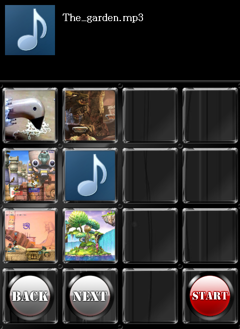

# goobeat

===============

##0.  들어가기 전에   
동아리 겨울방학 프로젝트로 만든 첫 게임입니다.  
모티브가 된 게임은 유비트 시리즈.   
첫 작품이라 그런지 실행하다가 죽어버리는 경우도 종종 있었습니다.  

- - -

##1. 소개 및 기능   
goobeat는 16키를 사용하는 리듬게임입니다.   
보통 리듬 게임의 채보는 사람이 직접 만드는 경우가 많은데, 이 채보를 만드는 것이 귀찮아서 제작했습니다.   

게임을 실행하면 음악 목록을 검색하고, 채보가 존재하지 않는 음악에 대한 채보를 생성합니다.   

메인 아이디어는 입력 wav 파일을 푸리에 변환을 통해 주파수 영역으로 변환하고, 각 주파수 영역의 값이 threshold보다 크다면 채보를 생성하는 것입니다. 

- - -

##2. 사용 키     
goobeat에서는 다음 16키를 사용합니다.

    1 2 3 4 
	Q W E R 
	A S D F
	Z X C V

- - -

##3. 현재 시점에서의 감상    
제작 당시 생각으로는 푸리에 변환 과정을 통해 큰 소리가 나는 타이밍에 채보를 생성할 것으로 예상되었습니다.   

다만 지금 생각해 보면 시간 단위의 지정이라든지, threshold값 설정의 어려움 등의 이유로 썩 만족스럽지는 않은 프로젝트였던 것 같습니다.   

또한 첫 작품임에도 불구하고 directx9, audiere를 제외한 외부 라이브러리 없이 전부 구현하려고 했던 것이 어려웠던 이유일 것 같습니다.

- - -

##4. Release Note   
>2013년 3월 첫 제작